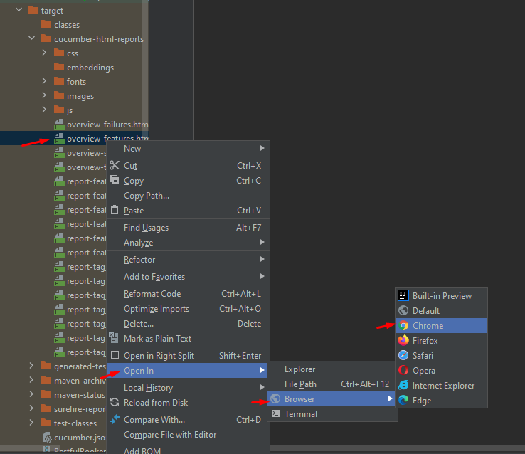
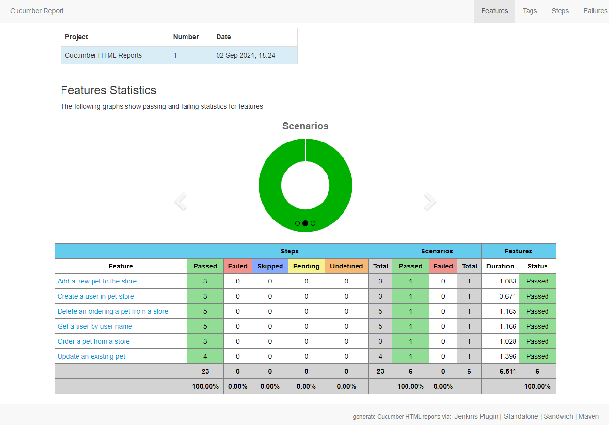

**How to run?**
* Open command prompt and go to application folder
* Write "mvn clean verify" and hit enter
* If you want to run specific feature, get the feature tag and set it into tags in TestRunner class

**Report**
* After running the application, it generates the report under the "target" folder
* Go to the target folder and open overview-features.html in any browser

* The report seems in the browser like:
